This project helped me winning **Selectel Career Wave**!

WIP: Add award photo, enhance readme quality, add monitoring services code, and a pgpool2 setup

## Demo

https://github.com/user-attachments/assets/0a9c1fa0-1200-4319-828b-c59e3ecd1ecc

> [!NOTE]
> **Why?**
> 1. For FUN (not everything needs to be built for profit!)
> 2. To demonstrate my skills in multiple fields
> 3. Don't you want a relatively small production ready database cluster that you can **CARRY AROUND** ? Cmon now.
> 4. To drain my wallet. I work for a reason, right?

## What is it?

```mermaid
graph BT
    %% Power Infrastructure
    PowerBank[⚡ 20,000mAh Power Bank<br/>~50W Power Delivery]
    
    %% Network Infrastructure  
    Switch[🔌 1 Gbps Network Switch]
    
    %% Computing Nodes
    Laptop[💻 Laptop<br/>Fedora Workstation 41<br/>Optional Main Node]
    RPi1[🔴 Raspberry Pi 5 #1<br/>Ubuntu Server LTS 42<br/>512GB PCIe SSD]
    RPi2[🔴 Raspberry Pi 5 #2<br/>Ubuntu Server LTS 42<br/>512GB PCIe SSD]
    RPi3[🔴 Raspberry Pi 5 #3<br/>Ubuntu Server LTS 42<br/>512GB PCIe SSD]
    
    %% Monitoring Hardware
    ESP32[📡 ESP32 Board<br/>PlatformIO + Arduino/ESP-IDF]
    Screen[📺 240x240 IPS Display<br/>Real-time Monitoring]
    
    %% Database Layer
    subgraph DB [" 🗄️ PostgreSQL Cluster Layer"]
        PG1[PostgreSQL<br/>Primary/Replica]
        PG2[PostgreSQL<br/>Primary/Replica] 
        PG3[PostgreSQL<br/>Primary/Replica]
        PGLaptop[PostgreSQL<br/>Primary/Replica]
        PGPool[pgpool2<br/>Load Balancer & Failover]
    end
    
    %% Monitoring Layer
    subgraph MON [" 📊 Monitoring Layer"]
        MonScript1[Python Monitoring<br/>System Stats]
        MonScript2[Python Monitoring<br/>System Stats]
        MonScript3[Python Monitoring<br/>System Stats]
        MonDisplay[Real-time Display<br/>Cluster Status]
    end
    
    %% Power Connections
    PowerBank -.->|Power| Switch
    PowerBank -.->|Power| RPi1
    PowerBank -.->|Power| RPi2  
    PowerBank -.->|Power| RPi3
    PowerBank -.->|Power| ESP32
    
    %% Network Connections
    Switch <-->|Ethernet| Laptop
    Switch <-->|Ethernet| RPi1
    Switch <-->|Ethernet| RPi2
    Switch <-->|Ethernet| RPi3
    
    %% Physical Monitoring Connections
    ESP32 <-->|SPI| Screen
    RPi1 <-->|UART| ESP32
    RPi2 -.->|UDP Socket| RPi1
    RPi3 -.->|UDP Socket| RPi1
    
    %% Database Logical Connections
    Laptop --> PGLaptop
    RPi1 --> PG1
    RPi2 --> PG2
    RPi3 --> PG3
    
    PGPool <--> PG1
    PGPool <--> PG2
    PGPool <--> PG3
    PGPool <--> PGLaptop
    
    PG1 <-.->|Async/Sync<br/>Replication| PG2
    PG2 <-.->|Async/Sync<br/>Replication| PG3
    PG3 <-.->|Async/Sync<br/>Replication| PGLaptop
    PG1 <-.->|Async/Sync<br/>Replication| PGLaptop
    
    %% Monitoring Logical Connections
    RPi1 --> MonScript1
    RPi2 --> MonScript2
    RPi3 --> MonScript3
    
    MonScript1 -.->|Stats| ESP32
    MonScript2 -.->|Stats| ESP32
    MonScript3 -.->|Stats| ESP32
    
    ESP32 --> MonDisplay
    Screen --> MonDisplay
    
    %% Styling
    classDef powerStyle fill:#ff6b6b,stroke:#d63447,stroke-width:2px,color:#fff
    classDef networkStyle fill:#4ecdc4,stroke:#26a69a,stroke-width:2px,color:#fff  
    classDef computeStyle fill:#45b7d1,stroke:#2980b9,stroke-width:2px,color:#fff
    classDef monitorStyle fill:#f9ca24,stroke:#f0932b,stroke-width:2px,color:#000
    classDef dbStyle fill:#6c5ce7,stroke:#5f3dc4,stroke-width:2px,color:#fff
    
    class PowerBank powerStyle
    class Switch networkStyle
    class Laptop,RPi1,RPi2,RPi3 computeStyle
    class ESP32,Screen monitorStyle
    class PG1,PG2,PG3,PGLaptop,PGPool dbStyle
```

### Components

0. My laptop (optional, as a main node)
1. 2/3x raspberry pi 5 boards + 512gb pcie gen3 ssd
2. 1 Gbps switch
3. 20.000 mah power bank with Power Delivery (~50w for 3 pi boards and switch)
4. esp32 board and a 240x240 IPS screen (simple monitoring)

### Interconnection

1. esp32 <-- SPI --> IPS screen
2. main rpi5 <-- UART --> esp32
3. adjacent rpi5's <-- UDP socket --> main rpi5
4. laptop <-- network switch (postgres networking) --> rpi5 boards cluster

### Software Used

1. It's a PostgreSQL cluster with configured async and sync replication on different nodes. Any node can be a main one - can be my laptop, can be any other node.
2. pgpoolII - for load balancing and a failover script to search and promote other nodes when the main one fails
3. Ubuntu Server LTS 42 as an OS on rpi5 boards, and Fedora Workstation 41 as an OS on my laptop
4. PlatformIO with arduino/esp-idf frameworks to program esp32 board.
5. Python with some libs to write monitoring scripts for rpi5's

> also some docker action, bash scripting, a lot of UNIX administration like networking, privileges e.t.c. (not important)

